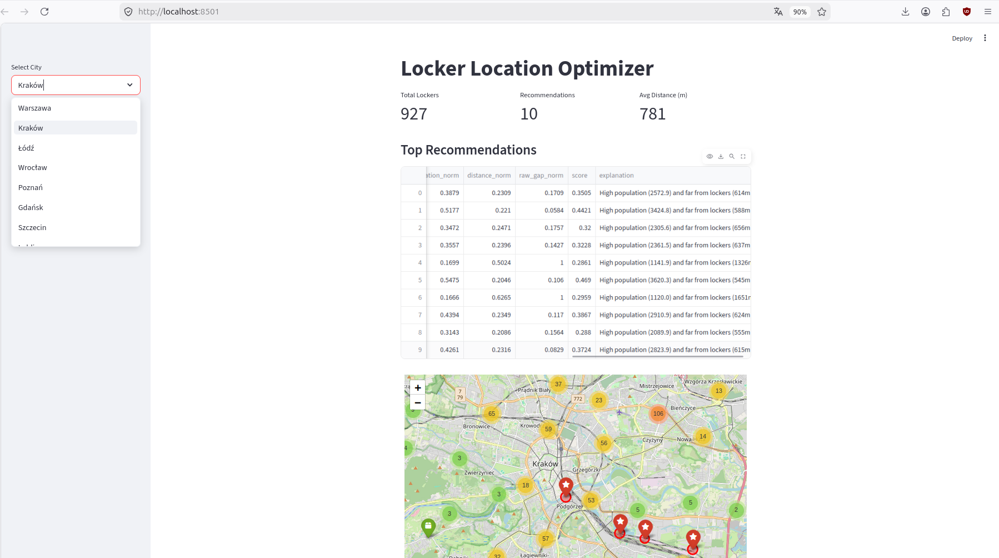
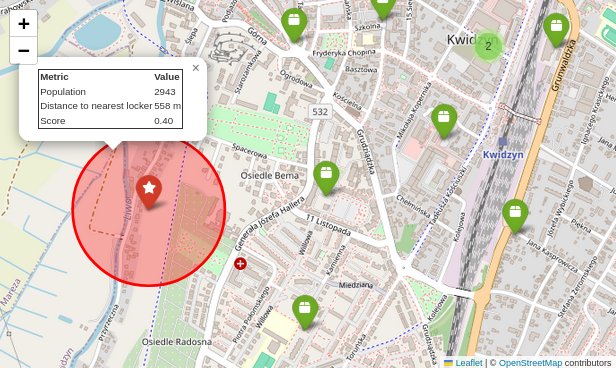
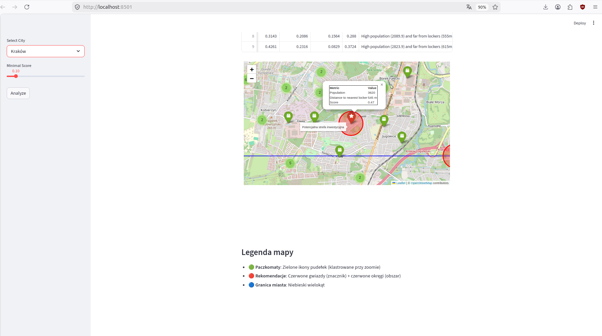

# Locker Location Optimizer

## Autor

* **Imię i nazwisko:** Adam Czakon
* **Email:** czakonadam@gmail.com

---

## Overview

Locker Location Optimizer to aplikacja do analizy przestrzennej, której celem jest wyznaczanie optymalnych lokalizacji dla nowych paczkomatów w miastach. System łączy rzeczywiste dane o istniejących punktach z informacjami o gęstości zaludnienia i analizą odległości.

Projekt odpowiada na praktyczne pytanie biznesowe: *gdzie należy postawić nowe paczkomaty, aby maksymalizować dostępność dla użytkowników, jednocześnie unikając nadmiernego zagęszczenia infrastruktury?*

---

## Demo & Description

Aplikacja implementuje kompletny pipeline analizy danych przestrzennych — od pobrania danych, przez ich przetworzenie, aż po wizualizację wyników.

### Jak działa system

1. Użytkownik wybiera miasto z listy
2. System pobiera rzeczywiste lokalizacje paczkomatów z API InPost
3. Tworzony jest powiększony bounding box (expanded bbox), aby uwzględnić okolice miasta
4. Generowana jest siatka punktów (~400 m)
5. Każdy punkt siatki jest wzbogacany o:

   * liczbę mieszkańców (z rastra GeoTIFF)
   * odległość do najbliższego paczkomatu
   * lokalną gęstość paczkomatów (w promieniu 1 km)
6. Obliczany jest wynik (score)
7. Dane są filtrowane i klastrowane
8. Zwracane są najlepsze lokalizacje wraz z uzasadnieniem
9. Wyniki są prezentowane w interfejsie Streamlit + mapa Folium

---

### Kluczowe decyzje projektowe

#### 1. Expanded Bounding Box

Zamiast analizować tylko granice miasta, system korzysta z powiększonego obszaru przy pobieraniu danych.

Dlaczego:

* unika błędów na krawędziach (edge effects)
* uwzględnia paczkomaty tuż poza granicą miasta

To podejście jest standardem w systemach GIS.

---

#### 2. Siatka przestrzenna (grid)

Miasto jest reprezentowane jako siatka punktów (~400 m), co zapewnia:

* równomierne pokrycie obszaru
* kontrolę nad rozdzielczością
* skalowalność

---

#### 3. Dane populacyjne z rastra

Zamiast danych zagregowanych (np. dzielnic), użyto rastra (GeoTIFF):

* większa dokładność przestrzenna
* brak zależności od granic administracyjnych

---

#### 4. Obliczanie odległości (BallTree + Haversine)

Do znajdowania najbliższych paczkomatów użyto:

* BallTree (wydajność)
* metryki Haversine (dokładność geograficzna)

To pozwala skalować rozwiązanie na duże miasta.

---

#### 5. Gęstość paczkomatów

Liczba paczkomatów w promieniu 1 km:

* pozwala wykrywać obszary już dobrze obsłużone
* wpływa na karanie takich lokalizacji w scoringu


---

#### 6. Funkcja scoringowa

System wykorzystuje ważoną funkcję scoringową opartą na znormalizowanych cechach:

```
score =
0.65 × population_norm +
0.25 × distance_norm +
0.1 × raw_gap_norm
```

gdzie:

* `population_norm` → znormalizowana liczba mieszkańców (potencjalny popyt)
* `distance_norm` → znormalizowana odległość do najbliższego paczkomatu (im większa, tym większa potrzeba nowego punktu)
* `raw_gap` → surowy wskaźnik niedosytu infrastruktury:

  ```
  raw_gap = 1 / (1 + nearby_lockers)
  ```
* `raw_gap_norm` → znormalizowana wersja wskaźnika nasycenia

Do normalizacji wszystkich cech używany jest **MinMaxScaler**, co sprowadza wartości do wspólnej skali [0, 1] i umożliwia ich ważenie.

Interpretacja wag:

* **0.65 (population)** → kluczowy czynnik popytowy (najważniejszy biznesowo)
* **0.25 (distance)** → potencjał lokalizacji wynikający z braku bliskich punktów
* **0.1 (gap factor)** → korekta uwzględniająca lokalne nasycenie paczkomatami

---

#### 7. Filtrowanie kandydatów

Przed końcową selekcją system stosuje warunki filtrujące:

* odległość do najbliższego paczkomatu > 500 m
* populacja > zadany próg (minimalny poziom aktywności obszaru)

Następnie spośród spełnionych warunków wybierane są najlepsze lokalizacje na podstawie rozkładu score:

```
top 20% wyników (percentyl 0.8)
```

Takie podejście pozwala:

* odrzucić obszary o niskim potencjale użytkowym
* uniknąć rekomendacji w już dobrze obsłużonych lokalizacjach
* skupić się na relatywnie najlepszych kandydatów w każdym mieście

---

#### 8. Klasteryzacja (DBSCAN)

DBSCAN:

* usuwa duplikaty lokalizacji
* grupuje bliskie punkty
* nie wymaga określenia liczby klastrów

To lepsze rozwiązanie niż np. k-means w tym przypadku.

---

### Interfejs użytkownika

Aplikacja zawiera UI w Streamlit:

* wybór miasta
* suwak minimalnego score
* metryki:

  * liczba paczkomatów
  * liczba rekomendacji
  * średnia odległość
* tabela wyników
* interaktywna mapa

Mapa zawiera:

* 🟢 istniejące paczkomaty
* 🔴 rekomendacje (skalowane wg score)
* 🔵 granice miasta

---

### Demo

#### Interfejs użytkownika


#### Mapa wyników


#### Mapa wraz z Legendą


---
## Technologies

* **Python 3.10+**
* **pandas, numpy** — przetwarzanie danych
* **requests** — komunikacja z API
* **scikit-learn**

  * BallTree
  * DBSCAN
* **rasterio** — dane przestrzenne (GeoTIFF)
* **folium** — wizualizacja map
* **streamlit** — UI

### Uzasadnienie wyboru

* BallTree → szybkie zapytania przestrzenne
* DBSCAN → naturalna klasteryzacja przestrzenna
* raster → większa dokładność niż dane agregowane
* Streamlit → szybkie prototypowanie UI

---

## How to run

### Wymagania

* Python 3.10+
* pip
* plik `population.tif`
* dostęp do internetu (API)

---

### Uruchomienie

```bash
git clone <your-repo-url>
cd locker-location-optimizer

python -m venv venv
source venv/bin/activate
# Windows:
# venv\Scripts\activate

pip install -r requirements.txt

streamlit run app.py
```

---

## What I would do with more time
- zastąpienie heurystycznego scoringu modelem uczącym się (np. Gradient Boosting / XGBoost)
- dostosowanie modelu do warunków miejskich i poza miejsckich ( inne wagi cech )
- rozszerzenie o większą liczbę miast
- możliwość sprawdzenia danego obszaru np: kraju, województwa, powiatu, gminy z danych GIS
- lepszy interfejs użytkownika
- dodania heatmap pokazujących gęstość zaludnienia i gęstość paczkomatów
- użycie bardziej dokładnych danych na temat populacji ( obecnie 1km^2 ) 
- integracja danych kontekstowych (POI, transport, gęstość ruchu) w celu modelowania rzeczywistego popytu i dostępności
- kalibracja modelu na danych historycznych (np. istniejące lokalizacje i ich wykorzystanie) zamiast ręcznie dobranych wag

## AI usage
Narzędzia AI (ChatGPT) były wykorzystywane jako wsparcie techniczne w trakcie tworzenia projektu.
Pomogły w:

- dopracowaniu struktury projektu
- wyjaśnieniu zagadnień geograficznych, w szczególności obliczania odległości (Haversine, praca na radianach)
- ulepszeniu interfejsu użytkownika w Streamlit i logiki jego działania

Wszystkie sugestie zostały zweryfikowane, dostosowane i zaimplementowane ręcznie, aby zapewnić poprawność oraz spójność całego systemu.

## Anything else?
Moim zdaniem, świetny pomysł na etap rekrutacji. Mam nadzieję że moja inicjatywa się Państwu spodoba. Z niecierpliwością czekam na odpowiedź i o Państwa zdaniu na temat tego projektu. Marzeniem byłoby pracować nad jednym z podobnych rozwiązań w Państwa firmie. Dziękuję za możliwość wykazania się.
